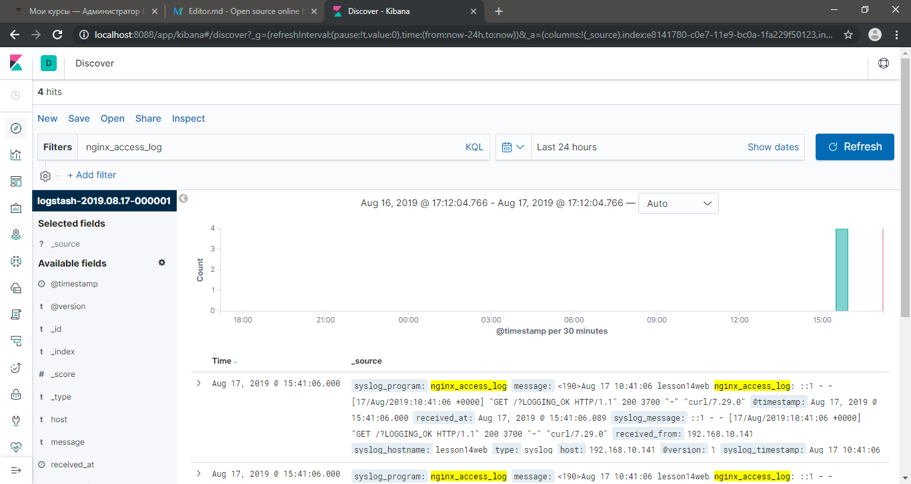
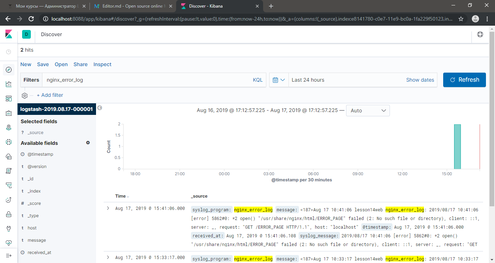
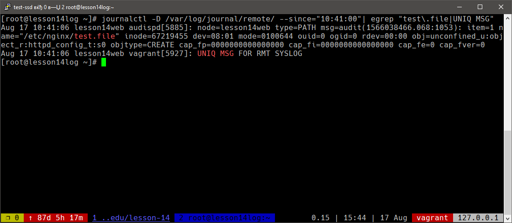

# Сбор и анализ логов

## [Начало](Vagrantfile "Начало")
Поднимаем три ВМ: web-сервер, сервер логов, ELK-сервер

## [ELK-сервер](p_elk.sh "ELK-сервер")
- Устанавливаем стэк Elasticsearch, Logstash, Kibana
- Настраиваем logstash на приём логов от web-сервера Nginx:
```json
input {
  tcp {
    port => 5400
    type => syslog
  }
  udp {
    port => 5400
    type => syslog
  }
}
```

## [Лог-сервер  (journald)](p_log.sh "Лог-сервер")
- Устанавливаем systemd-journal-gateway
- Поднимаем сервис systemd-journal-remote для получения логов извне

## [Web-сервер](p_web.sh "Web-сервер")
- Устанавливаем nginx и systemd-journal-gateway
- Указываем уровень хранимых логов, в /etc/systemd/journald.conf указываем MaxLevelStore=crit
- Активируем /etc/audisp/plugins.d/syslog.conf, что позволяет хранить логи аудита в общем syslog-журнале
- В /etc/systemd/journal-upload.conf указываем адрес для отправки логов
- Настраиваем nginx на отправку логов в logstash и хранение в логе только критичных данных
```shell
error_log /var/log/nginx/error.log crit;
error_log syslog:server=192.168.10.143:5400,tag=nginx_error_log,severity=info;
access_log syslog:server=192.168.10.143:5400,tag=nginx_access_log,severity=info;
```
- Стартуем службы
- Создаем тестовые события создающие:
    - тестовый файл в папке /etc/nginx
    - запись в access логе nginx
    - запись в error логе nginx
    - запись в системном логе

## Результаты
#### Kibana
События из access.log nginx


События из error.log nginx


Записи пришедшие на лог-сервер с web-сервера

