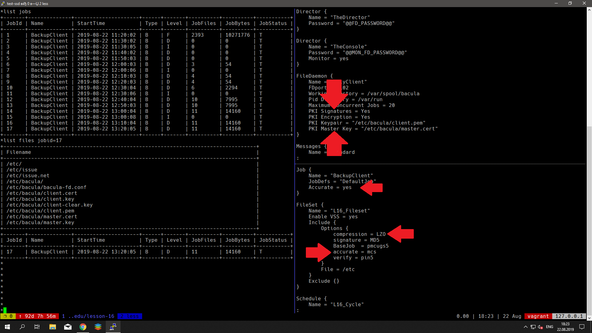

# Резервное копирование

## [Начало](Vagrantfile "Начало")
Поднимаем две ВМ: сервер и клиент bacula
Провиженим bash-скриптами

## Конфигурирование bacula-director
В конфигурационном файле [bacula-dir.conf](bacula-dir.conf "bacula-dir.conf"):
- в разделе Schedule указываем время и тип бэкапа
- в разделе FileSet кроме списка файлов задаем параметры сжатия и дедупликации
- в Client обозначаем параметры подключения клиента (точки резервирования)
- в Storage - адрес подключения хранилища
- разделе Job определяет параметры задания, умолчания наследуются из JobDefs

## Конфигурирование bacula-storage
В конфигурационном файле [bacula-sd.conf](bacula-sd.conf "bacula-sd.conf") определяются параметры и места хранения файлов, а так-же указывается адрес bacula-director

## Конфигурирование bacula-client
В конфигурационном файле [bacula-fd.conf](bacula-fd.conf "bacula-fd.conf") указываем необходимость шифрования и адрес сервера

##### Списки бэкапов и файлов | Кофигурация сжатия, шифрования и дедупликации

