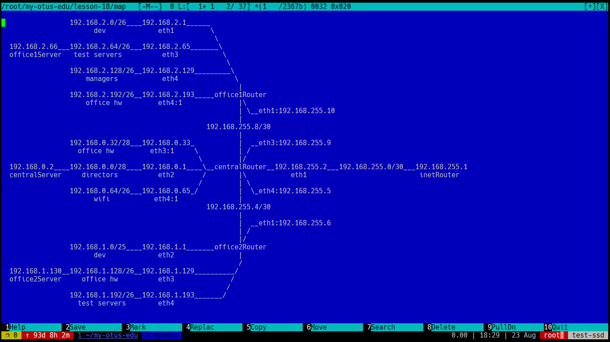

#Теория
| *Название*|*Подсеть*|*Broadcast*|*Узлов*|
| :------------ | :------------ | :------------ | :------------ |
|**central**|**192.168.0.0/24**|||
|directors|.0/28|.15|14|
|free|.16/28|.31|14|
|office hw|.32/28|.47|14|
|free|.48/28|.63|14|
|wif|.64/26|.127|62|
|free|.128/25|.255|126|
|**office2**|**192.168.1.0/24**|||
|dev|.0/25|.127|126|
|test servers|.128/26|.191|62|
|office hw|.192.26|.255|62|
|**office1**|**192.168.2.0/24**|||
|dev|.0/26|.63|62|
|test servers|.64/26|.127|62|
|managers|.128/26|.191|62|
|office hw|.192/26|.255|62|

Ошибок адресации нет, но наименование сетей может внести путаницу - несоответствие номера офиса третьему октету (office**1**, 192.168.**2**.0)

#Практика
####Карта сети

####Конфигурация
[Vagrantом создаем](Vagrantfile "Vagrantом создаем") семь виртуальных узлов сети с конфигурацией соответствующей их размещению.
